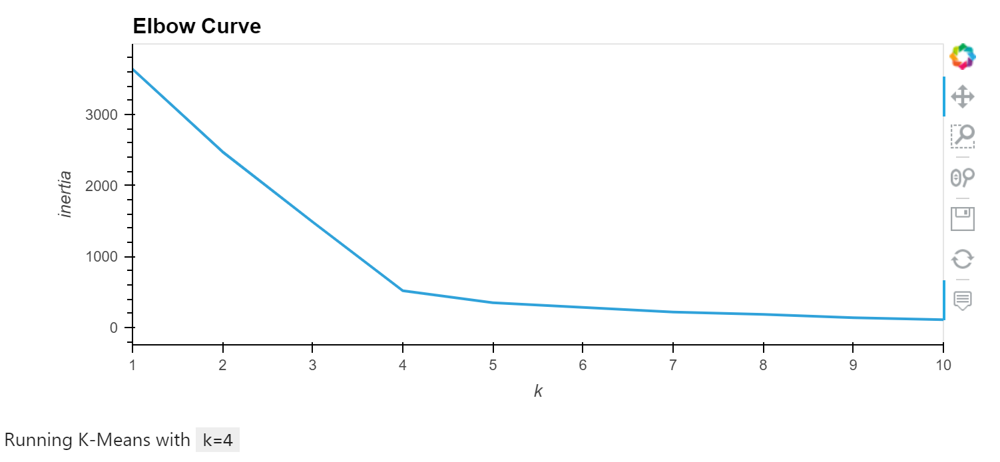

# Cryptocurrencies
Analyzing a dataset of cryptocurrencies using unsupervised machine learning models in order to conclude the best cryptocurrencies to invest in.

# Overview of the Analysis :

# Purpose :
Accountability Accounting, a prominent investment bank, is interested in offering a new cryptocurrency investment portfolio for its customers. The company, however, is lost in the vast universe of cryptocurrencies. We've created a report that includes what cryptocurrencies are on the trading market and how they could be grouped to create a classification system for this new investment.

Since there is no known output, we've decided to use unsupervised learning. To group the cryptocurrencies, we've decided on a clustering algorithm and use data visualizations to share the findings with the board.

Tools used :
We have used pandas to write our python code using the multiple libraries.

# Results :
## Deliverable 1 : Preprocessing the Data for PCA

The following five preprocessing steps have been performed on the crypto_df DataFrame:
1. All cryptocurrencies that are not being traded are removed.
2. The IsTrading column is dropped.
3. All the rows that have at least one null value are removed.
4. All the rows that do not have coins being mined are removed.
5. The CoinName column is dropped.

A new DataFrame called crypto_names_df is created that stores all cryptocurrency names from the CoinName column and retains the index from the crypto_df DataFrame.

The get_dummies() method is used to create variables for the text features, which are then stored in a new DataFrame, X .

The features from the X DataFrame have been standardized using the StandardScaler fit_transform() function.

## Deliverable 2: Reducing Data Dimension

1. The PCA algorithm reduces the dimensions of the X DataFrame down to three principal components.

2. The pcs_df DataFrame is created and has the following three columns, PC 1, PC 2, and PC 3, and has the index from the crypto_df DataFrame.

## Deliverable 3: Clustering Cryptocurrencies Using K-means
The K-means algorithm is used to cluster the cryptocurrencies using the PCA data, where the following steps have been completed:
1. An elbow curve is created using hvPlot to find the best value for K.

2. Predictions are made on the K clusters of the cryptocurrencies’ data.

3. A new DataFrame is created with the same index as the crypto_df DataFrame and has the following columns: Algorithm, ProofType, TotalCoinsMined, TotalCoinSupply, PC 1, PC 2, PC 3, CoinName, and Class

## Deliverable 4: Visualizing Cryptocurrencies Results

The clusters are plotted using a 3D scatter plot, and each data point shows the CoinName and Algorithm on hover.

A table with tradable cryptocurrencies is created using the hvplot.table() function.

The total number of tradable cryptocurrencies is 532.

A DataFrame is created that contains the clustered_df DataFrame index, the scaled data, and the CoinName and Class columns.
A hvplot scatter plot is created where the X-axis is "TotalCoinsMined", the Y-axis is "TotalCoinSupply", the data is ordered by "Class", and it shows the CoinName when you hover over the data point.

## Summary :
The above analysis shows the different classes for the tradable cryptocurrencies thereby helping the investors analyze the classes further in order to make the right investment decision.